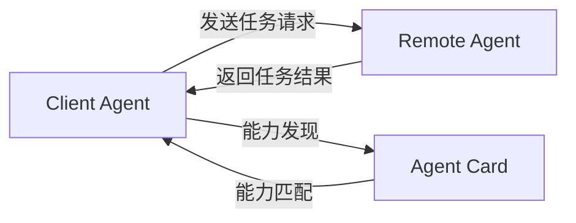
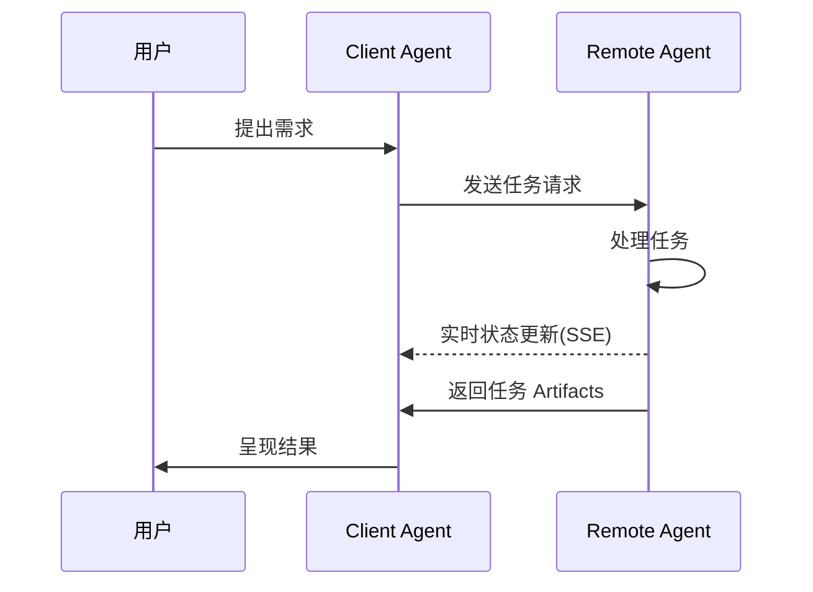
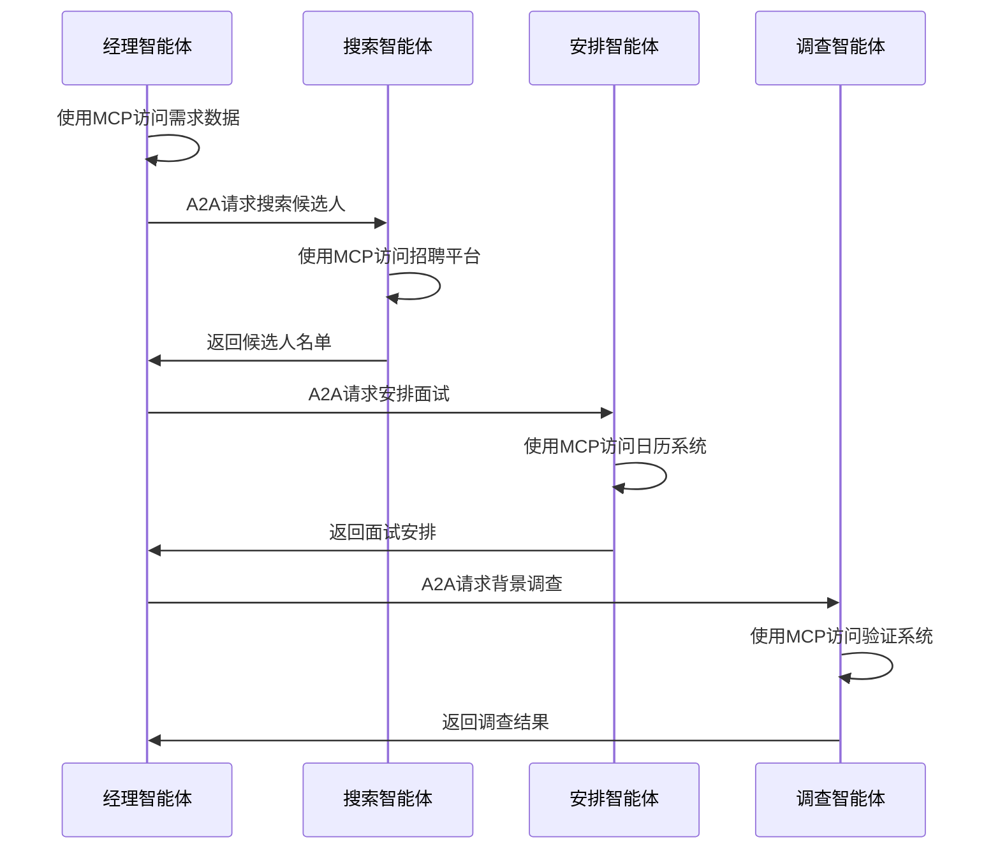

**核心内容:**
- **A2A 协议**：实现不同供应商的 AI 智能体之间的互操作性，打造代理间的沟通桥梁。
- **MCP 协议**：标准化 AI 应用与外部工具、数据源和服务的交互方式，减少 AI 开发中的碎片化问题。
- **协同作用**：A2A 协议解决代理之间的交互，MCP 协议解决代理与外部工具的交互，共同构建智能代理生态系统。

A2A 和 MCP 两种协议正在塑造智能体系统的未来。本文将探讨 A2A 协议与 MCP 协议的特点、区别及协同作用，帮助开发者和产品设计师更好地理解这一新兴技术领域。

在 AI 快速发展的今天，代理技术（Agent）正在成为下一个重要的技术浪潮。为了解决 AI 之间的交流与协作问题，两个重要的协议标准应运而生：Google 的 [A2A（Agent-to-Agent）协议](https://www.a2aprotocol.net) 和 Anthropic 的 [MCP（Model Context Protocol）协议](/)。这两个协议从不同角度解决了 AI 智能体系统中的关键挑战，共同构建起未来 AI 智能体生态系统的基础架构。

本文将探讨**A2A 协议**与**MCP 协议**的特点、区别及协同作用，帮助开发者和产品设计师更好地理解这一新兴技术领域。

## A2A 协议：打造代理间的沟通桥梁

### A2A 协议的核心概念

**A2A 协议**是由 Google 与 50 多家行业合作伙伴共同开发的开放协议，旨在实现不同供应商的 AI 智能体之间的互操作性。无论这些代理是谁构建的、在哪里托管或使用什么框架，**A2A 协议**都能使它们无缝协作。

### A2A 协议的技术实现

**A2A 协议**采用**JSON-RPC 2.0 over HTTP(S)**作为通信机制，并支持**Server-Sent Events (SSE)**进行实时更新流。这种设计使得不同平台上的代理能够高效地交换信息。

### A2A 协议的通信模型

在**A2A 协议**中，定义了两种代理角色：

1. **Client Agent**：发起请求或任务
2. **Remote Agent**：接收请求并尝试完成任务

通信过程首先可能涉及**能力发现（Capability Discovery）**，以确定哪个代理最适合执行特定任务。

### 智能体卡片与能力发现

每个智能体可以发布**智能体卡片（Agent Card）** — 一个 JSON 元数据文档，通常托管在标准 URL（如`/.well-known/agent.json`）。智能体卡片描述了该智能体的功能、技能、API 端点和身份验证要求。

客户端智能体通过阅读智能体卡片，可以识别出最适合当前任务的合作伙伴智能体。

### 任务管理机制

**A2A 协议**中的所有交互都围绕执行任务展开。任务是由协议定义的结构化对象，包含请求详情并跟踪其状态。结果以 **Artifacts** 的形式返回，智能体可以在执行过程中发送结构化**消息（Messages）**进行协调或澄清。

## MCP 协议：模型与外部世界的连接器

### MCP 协议的基本框架

**MCP 协议**（Model Context Protocol）是 Anthropic 开发的开放协议，旨在标准化 AI 应用（如聊天机器人、代理和 IDE）与外部工具、数据源和服务的交互方式。它通过提供统一的接口来整合上下文信息，从而减少 AI 开发中的碎片化问题。

### MCP 协议的核心组件

**MCP 协议**包含三个关键组件：

1. **工具（Tools）**：模型控制的动作（如获取数据、写入数据库）
2. **资源（Resources）**：应用控制的数据（如文件、JSON、附件）
3. **提示（Prompts）**：用户控制的预定义模板（如 IDE 中的斜杠命令）

### MCP 协议的价值与意义

**MCP 协议**带来的主要价值包括：

1. **减少碎片化**：提供标准方式连接 AI 应用与工具和数据，避免团队构建自定义集成
2. **实现组合性**：代理和应用可以动态发现和使用新工具，无需预编程
3. **支持企业工作流**：团队可以拥有特定服务并通过**MCP 协议**暴露给其他团队使用

### MCP 协议的应用场景

**MCP 协议**已在多个领域得到应用：

- **IDE（如 Cursor、Zed）**：使用**MCP 协议**引入代码上下文、GitHub 问题和文档
- **代理**：自主调用工具（如搜索网络、查询数据库）
- **远程服务器与 OAuth**：支持远程**MCP 协议**服务器和安全认证

## A2A 协议与 MCP 协议的协同与区别

### 两种协议的功能定位

**A2A 协议**与**MCP 协议**解决了 AI 智能体生态系统中不同层面的挑战：

- **A2A 协议**：解决代理之间如何互相交互（水平集成）
- **MCP 协议**：解决代理如何与工具或外部上下文交互（垂直集成）

### 功能互补性分析

这两种协议相互补充，共同解决构建多代理、多 LLM 和多源上下文系统的核心挑战：

1. **A2A 协议**专注于代理之间的标准化通信（代理到代理）
2. **MCP 协议**专注于代理与外部工具和系统的交互（代理到工具）

### 协议生态系统的未来展望

随着**A2A 协议**和**MCP 协议**的普及，我们可以预见：

1. **MCP 服务器**的增长：各种服务提供商可能会提供特定功能的**MCP 服务器**
2. **智能体网络**的形成：智能体可以通过**A2A 协议**组成协作网络，分工合作
3. **工作流自动化**的进化：复杂任务可以被分解并由多个专业智能体协作完成

## 实际应用：A2A 协议与 MCP 协议的协同使用场景

### 企业应用场景

在企业环境中，**A2A 协议**和**MCP 协议**可以协同工作，实现复杂的自动化场景：

#### 招聘流程自动化

1. 招聘经理的智能体（使用**MCP 协议**访问公司数据库）确定招聘需求
2. 通过**A2A 协议**，该智能体与专业的人才搜索智能体协作
3. 人才搜索智能体（通过**MCP 协议**）访问 LinkedIn 等平台获取人才信息
4. 面试安排智能体通过**A2A 协议**接收任务，并使用**MCP 协议**与日历系统交互
5. 背景调查智能体通过类似方式完成其任务

### 消费者应用场景

在消费者领域，两种协议的结合同样能带来全新的用户体验：

#### 旅行规划助手

1. 用户的个人助理智能体（通过**MCP 协议**访问用户数据）收集旅行偏好
2. 该智能体使用**A2A 协议**与专业旅行代理协作
3. 旅行智能体通过**MCP 协议**访问航班、酒店和景点数据
4. 通过**A2A 协议**，预算管理智能体参与规划财务安排
5. 最终计划通过**MCP 协议**被整合到用户的日历和旅行应用中

## 开发者注意事项：集成 A2A 协议与 MCP 协议

### 安全性考量

在实现**A2A 协议**和**MCP 协议**时，开发者需要特别注意安全性问题：

1. **身份验证与授权**：代理将代表用户行动，凭证必须在整个流程中得到保护
2. **多身份联合**：用户可能需要为不同系统提供不同身份
3. **权限范围控制**：确保代理只能访问必要的资源

### 实施路径建议

对于希望采用这些协议的开发者，建议以下实施路径：

1. 首先实现**MCP 协议**集成，使代理能够访问工具和上下文
2. 然后实现**A2A 协议**支持，使代理能够与其他代理协作
3. 创建代理卡片，明确声明代理的能力和服务边界
4. 设计适当的用户界面，使用户能够控制代理行为和授权范围

## 结论：A2A 协议与 MCP 协议共同构建的未来

**A2A 协议**和**MCP 协议**代表了 AI 智能体技术的重要进步，它们共同为更智能、更协作的代理生态系统奠定了基础。这些协议不仅仅是技术规范，更是新一代 AI 应用架构的基石。

随着这些协议的成熟和广泛采用，我们将看到：

1. AI 智能体能力的显著增强，从单一功能走向复杂协作
2. 跨平台、跨供应商的 AI 智能体协作成为常态
3. 新型应用和服务模式的出现，重新定义用户与 AI 的交互方式

对于开发者和企业来说，了解并采用**A2A 协议**和**MCP 协议**将是把握 AI 智能体技术浪潮的关键一步。
